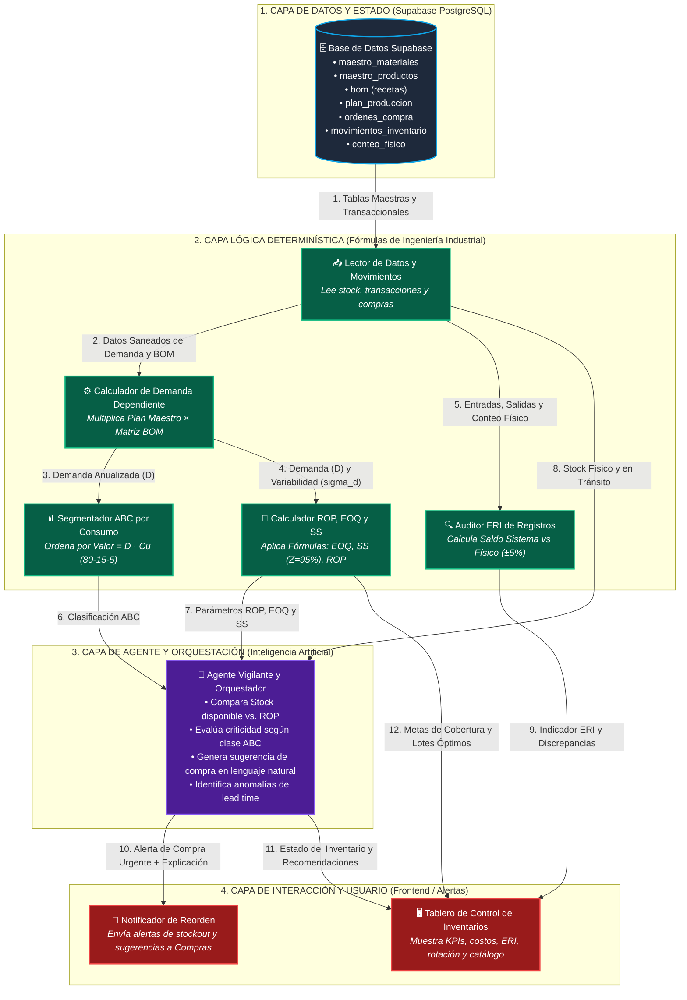
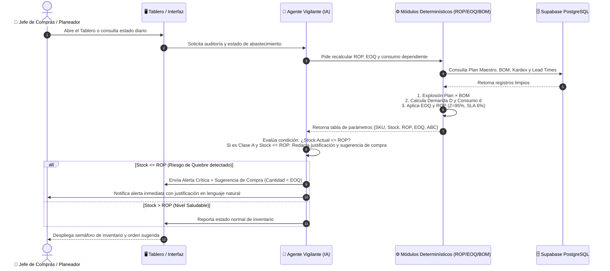
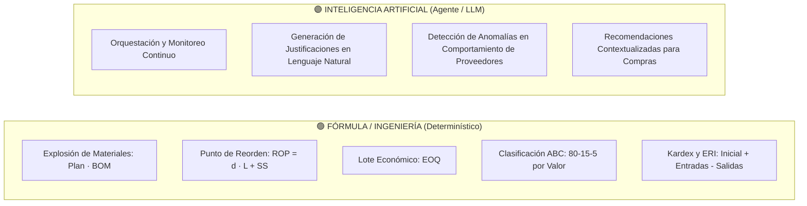

# 📐 Documento de Arquitectura de Sistemas — Solución de Reposición y Abastecimiento E2 SAS
## Especificación de Arquitectura de Software, Componentes, Interfaces y Flujos — Fase E2

> **Institución:** Universidad de Medellín — Facultad de Ingenierías — Ingeniería Industrial  
> **Asignatura:** Producción 4.0 / Énfasis 2  
> **Fase del Proyecto:** Segunda Entrega — E2 (Arquitectura y Diseño del Sistema)  
> **Cliente:** E2 SAS — Mobiliario Metálico para Oficina  
> **Problema Central Atacado:** Cuello de botella en Lead Times de proveedores, desabastecimiento de insumos críticos (Lámina/Vidrio), inmovilización de capital ($3.550M en Plata Muerta) y descontrol de registros (ERI).  
> **Enfoque de Diseño:** Arquitectura en 4 Capas con separación estricta entre **Estado (Datos)**, **Fórmulas Determinísticas (Ingeniería Industrial)**, **Agente Orquestador (IA)** e **Interfaz de Usuario**.

---

## 📌 1. Resumen Ejecutivo del Diseño de Arquitectura

Siguiendo las directrices metodológicas de la Universidad de Medellín:
1. **Cada componente tiene UNA sola responsabilidad bien definida (Alta Cohesión).**
2. **Las piezas están desacopladas (Bajo Acoplamiento):** Cambiar una no rompe las demás.
3. **El Estado está 100% separado de la Lógica:** Todos los datos residen en **Supabase (PostgreSQL)**; la base de datos no "hace" cálculos, solo resguarda la verdad transaccional.
4. **Separación rigurosa entre Fórmulas e Inteligencia Artificial:**
   - 🟢 **Fórmulas Determinísticas (Sin IA):** Cálculo de Demanda Dependiente (Plan $\times$ BOM), Clasificación ABC por Valor de Consumo, Lote Económico ($EOQ$), Stock de Seguridad ($SS_{95\%}$) y Punto de Reorden ($ROP$).
   - 🟣 **Agente Orquestador (Con IA):** Vigila continuamente los saldos, compara $Stock \le ROP$, detecta anomalías, redacta justificaciones en lenguaje natural para Compras y orquesta las notificaciones.
   - 🔴 **Capa de Interacción:** Tablero de control ejecutivo y sistema de alertas automáticas.

---

## 🏗️ 2. Diagrama General de Arquitectura de Componentes

---

## 🧩 3. Descomposición de Componentes, Responsabilidades y Contratos

Cada componente fue diseñado bajo el principio de **Responsabilidad Única**. La siguiente matriz especifica el contrato de interfaz de cada pieza:

| Capa | Componente | Tipo de Procesamiento | ¿Qué RECIBE? (Entrada) | ¿Qué HACE? (Responsabilidad Única) | ¿Qué DEVUELVE? (Salida) |
|---|---|:---:|---|---|---|
| **Datos** | `Base de Datos Supabase` | **Estado** | Peticiones SQL / REST de lectura y escritura. | Almacena y resguarda el estado canónico e inmutable del sistema en 3FN. | Tablas relacionales con integridad referencial. |
| **Lógica** | `Lector de Datos (C1)` | **Fórmula / ETL** | Conexión a Supabase (`apikey`, `jwt`). | Extrae y valida los registros de inventario, órdenes de compra y movimientos. | DataFrames de Python con datos estructurados y limpios. |
| **Lógica** | `Calculador de Demanda Dependiente (C2)` | **Fórmula Matemática** | `plan_produccion` (18 PTs) + `bom` (recetas). | Ejecuta la explosión del BOM: $D_i = \sum [Plan_j \times BOM_{j,i}]$, y anualiza el consumo. | Demanda Anual ($D_i$) y Consumo Diario ($d_i$) por SKU. |
| **Lógica** | `Segmentador ABC (C3)` | **Fórmula Matemática** | Demanda Anual ($D_i$) + Costo Unitario ($C_{u,i}$). | Calcula $\text{Valor Consumo} = D_i \times C_{u,i}$, ordena de mayor a menor y asigna categorías A (80%), B (15%), C (5%). | Categoría ABC formal por SKU. |
| **Lógica** | `Calculador ROP, EOQ y SS (C4)` | **Fórmula Matemática** | $D_i, d_i, C_{u,i}, \sigma_{d,i}, L_{\text{real}}, C_o, i$. | Aplica las ecuaciones determinísticas: • $EOQ = \sqrt{\frac{2 D C_o}{i C_u}}$ • $SS = 1.645 \cdot \sigma_d \sqrt{L}$ ($Z=95\%$ / SLA 6%) • $ROP = d \cdot L + SS$. | Parámetros óptimos: $EOQ_i, SS_i, ROP_i$. |
| **Lógica** | `Auditor ERI (C5)` | **Fórmula Matemática** | `inventario_inicial`, `movimientos`, `conteo_fisico`. | Reconstruye $\text{Sistema} = \text{Inicial} + \text{Entradas} - \text{Salidas} \pm \text{Ajustes}$ y calcula ERI ($\pm 5\%$). | Score ERI global y lista de SKUs descuadrados. |
| **Agente** | `Agente Vigilante y Orquestador` | **Inteligencia Artificial** | Stock actual, $ROP$, $EOQ$, ABC, Lead Time y órdenes en tránsito. | Monitorea la condición $Stock \le ROP$, pondera criticidad, redacta justificación en lenguaje natural y decide alertar. | Objeto JSON con sugerencia de orden de compra y explicación textual. |
| **Interfaz** | `Notificador de Reorden` | **Herramienta / Canal** | Mensaje estructurado del Agente. | Transmite la notificación a compras / planeación (Slack, Email o Webhook). | Confirmación de entrega de alerta. |
| **Interfaz** | `Tablero de Control de Inventarios` | **Frontend / UI** | KPIs, parámetros $ROP/EOQ$, ERI y sugerencias del Agente. | Renderiza paneles ejecutivos interactivos para consulta gerencial y operativa. | Vista visual para toma de decisiones. |

---

## 🔄 4. Diagrama de Secuencia y Flujo de Datos (Caso de Uso: Evaluación de Reorden)

Este diagrama modela el flujo temporal paso a paso cuando el sistema evalúa los materiales críticos para evitar desabastecimientos:

---

## ⚖️ 5. Justificación Técnica: ¿Por Qué Fórmulas y Por Qué Inteligencia Artificial?

Siguiendo el principio de las diapositivas (*"Usar IA para calcular un ROP es la herramienta equivocada"*):

### 1. ¿Por qué usamos FÓRMULAS para los cálculos de inventario?
* **Exactitud Matemática y Auditoría:** El cálculo del ROP, el EOQ, la explosión del BOM y la reconciliación del Kardex obedecen a principios contables y leyes de ingeniería cerradas. Un modelo de lenguaje o una red neuronal no garantiza precisión exacta en operaciones aritméticas directas; las fórmulas matemáticas sí.
* **Costo Computacional Cero:** Ejecutar una fórmula en Python/SQL toma microsegundos y no consume tokens de API.

### 2. ¿Por qué usamos INTELIGENCIA ARTIFICIAL para el Agente?
* **Orquestación y Razonamiento Contextual:** El Agente no calcula el ROP; el Agente **interpreta** el resultado del ROP, cruza la criticidad ABC, analiza si hay órdenes abiertas en camino y decide si la situación amerita una alerta urgente o una compra programada.
* **Explicabilidad en Lenguaje Natural:** Transforma números y tablas complejas en explicaciones claras para el equipo de compras (*"Se sugiere emitir OC para 193 láminas MP-0020 con PROV-08 porque el stock físico (150 unids) está por debajo del ROP (563 unids) y el proveedor tarda 21 días reales"*).
* **Tratamiento de Ambigüedad:** Detecta inconsistencias léxicas, observaciones del jefe de bodega y desviaciones anormales en entregas.

---

## 📋 6. Checklist de Verificación de Arquitectura (Universidad de Medellín)

| Criterio de Calidad de la Arquitectura | Cumplimiento en el Diseño de E2 SAS | Evidencia Técnica |
|---|:---:|---|
| **1. Cada componente tiene UNA responsabilidad clara** | ✅ **100%** | Cada caja tiene un nombre formal `Verbo + Qué` (ej: `Calculador de Demanda`, `Auditor ERI`, `Agente Vigilante`). |
| **2. Las conexiones definen qué datos viajan (Contratos)** | ✅ **100%** | Todas las flechas del diagrama especifican el payload exacto (entradas y salidas estructuradas). |
| **3. El Estado está separado de la Lógica** | ✅ **100%** | Supabase (PostgreSQL) almacena el estado; los módulos de cálculo en Python ejecutan la lógica sin mutar la base sin control. |
| **4. Se distingue claramente qué es Fórmula y qué es IA** | ✅ **100%** | Módulos verdes (determinísticos: ROP, EOQ, ABC, BOM) vs. Módulos morados (Agente IA: vigilancia, orquestación y lenguaje natural). |
| **5. Ataca el cuello de botella real del diagnóstico** | ✅ **100%** | El sistema ataca directamente el **desfase de Lead Time (21 días reales)** mediante $ROP$ dinámico y la **demanda dependiente del BOM**. |
| **6. Se entiende sin explicación oral y es modular** | ✅ **100%** | Los diagramas de bloques y secuencia permiten construir cada componente por separado en la Fase E3. |

---

> **Ubicación en el Repositorio:** [`informes/ARQUITECTURA_DEL_SISTEMA_E2.md`](informes/ARQUITECTURA_DEL_SISTEMA_E2.md)  
> **Script de Respaldo del Modelo:** [`python/analisis/modelo_inventarios_eri_abc_eoq_rop.py`](python/analisis/modelo_inventarios_eri_abc_eoq_rop.py)
