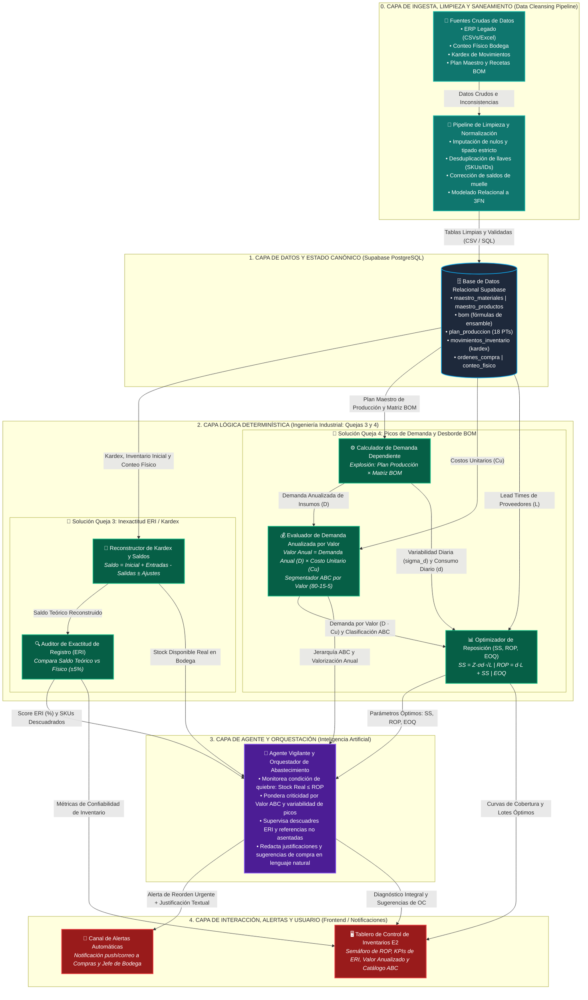
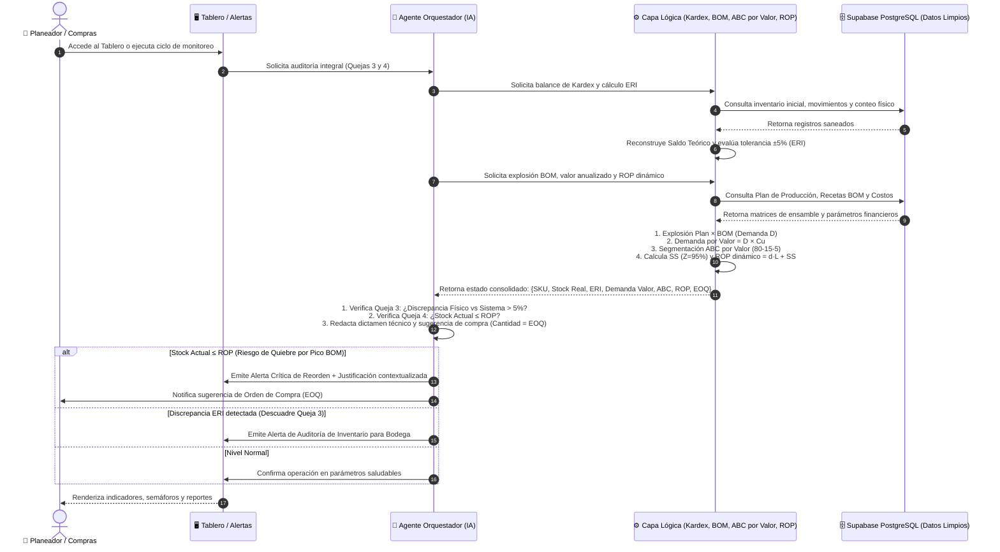
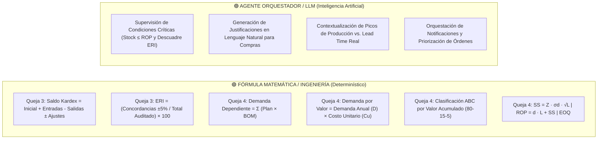

# 📐 Documento de Arquitectura de Sistemas — Solución de Reposición y Abastecimiento E2 SAS
## Especificación de Arquitectura de Software, Componentes, Interfaces y Flujos — Fase E2

> **Institución:** Universidad de Medellín — Facultad de Ingenierías — Ingeniería Industrial  
> **Asignatura:** Producción 4.0 / Énfasis 2  
> **Fase del Proyecto:** Segunda Entrega — E2 (Arquitectura y Diseño del Sistema)  
> **Cliente:** E2 SAS — Mobiliario Metálico para Oficina  
> **Foco del Sistema (2 Problemas Centrales Atacados):**
> 1. 🔴 **Queja 3 (Inexactitud de Registro de Inventario - ERI / Desfase Kardex vs. Físico):** Discrepancia del 28.33% de exactitud, 93 SKUs con saldos negativos por desfase de muelle y existencia de sistemas paralelos de conteo.
> 2. 🔴 **Queja 4 (Picos de Demanda en PT y Desborde Multiplicativo en la Matriz BOM):** Alta volatilidad ($CV > 0.53$) en archivadores/estanterías que desbordan la demanda dependiente de insumos críticos compartidos sin amortiguación de Stock de Seguridad ni ROP dinámico.
> 
> **Enfoque de Diseño:** Arquitectura desacoplada en 5 Capas con separación estricta entre **Limpieza y Saneamiento**, **Estado Canónico (Datos)**, **Fórmulas Determinísticas de Ingeniería Industrial (Demanda Anualizada por Valor, BOM, ERI, EOQ, ROP)**, **Agente Orquestador (IA)** e **Interfaz de Usuario / Alertas**.

---

## 📌 1. Resumen Ejecutivo del Diseño de Arquitectura

El diseño arquitectónico responde a las directrices de ingeniería de software y analítica de operaciones:

1. **Capa Previa de Limpieza y Saneamiento de Datos (Data Cleansing Pipeline):** Antes de persistir cualquier registro en la base de datos central, los datos crudos pasan por un pipeline de validación, imputación, desduplicación y normalización a 3FN.
2. **Estado Canónico Separado de la Lógica:** Todos los datos limpios residen en **Supabase (PostgreSQL)**. La base de datos resguarda la verdad transaccional e integridad referencial sin ejecutar cálculos pesados de optimización.
3. **Cálculo de Demanda Anualizada por Valor ($Valor = Demanda \ Anual \times Costo$):** La demanda de insumos no se evalúa únicamente en unidades de consumo físico, sino mediante el **Valor Monetario Anualizado de la Demanda** ($D_i \times C_{u,i}$), base matemática indispensable para la jerarquización ABC de Pareto (80-15-5) y el dimensionamiento financiero del inventario.
4. **Fórmulas Determinísticas para los 2 Problemas (Sin IA):**
   - **Para Queja 3:** Reconstrucción matemática del Kardex ($\text{Inicial} + \text{Entradas} - \text{Salidas} \pm \text{Ajustes}$) y cálculo de tolerancia $\pm 5\%$ del indicador ERI/IRA.
   - **Para Queja 4:** Explosión del Plan Maestro de Producción sobre la matriz BOM ($D_i = \sum [Plan_j \times BOM_{j,i}]$), cálculo de variabilidad diaria ($\sigma_d$), Stock de Seguridad dinámico ($SS_{95\%}$) y Punto de Reorden ($ROP$).
5. **Agente Orquestador (Con IA):** Vigila continuamente los saldos reales vs. $ROP$, monitorea las desviaciones de ERI, detecta anomalías de entrega y redacta sugerencias ejecutivas de compra en lenguaje natural para Compras y Operaciones.

---

## 🏗️ 2. Diagrama General de Arquitectura de Sistemas (5 Capas)

---

## 🧩 3. Descomposición de Componentes, Responsabilidades y Contratos

Cada módulo posee **Responsabilidad Única**, interfaz determinística y contratos de datos estructurados:

| Capa | Componente | Enfoque / Problema | ¿Qué RECIBE? (Entrada) | ¿Qué HACE? (Responsabilidad Única) | ¿Qué DEVUELVE? (Salida) |
|---|---|:---:|---|---|---|
| **0. Limpieza** | `Pipeline de Limpieza y Normalización` | **Calidad de Datos** | Archivos crudos (CSV / Excel / Logs). | Elimina registros corruptos, imputa nulos, corrige desfases de muelle y estructura tablas en 3FN. | Datasets saneados listos para base de datos. |
| **1. Datos** | `Supabase PostgreSQL` | **Estado Canónico** | Scripts SQL / Peticiones REST autenticadas. | Almacena y garantiza la integridad referencial de maestros, recetas BOM y transacciones. | Tablas relacionales normalizadas. |
| **2. Lógica** | `Reconstructor de Kardex` | **Queja 3 (ERI)** | `inventario_inicial`, `movimientos_inventario`. | Reconstruye el saldo teórico formal: $S_t = S_0 + \sum Entradas - \sum Salidas \pm \sum Ajustes$. | Saldo teórico por SKU. |
| **2. Lógica** | `Auditor ERI / IRA` | **Queja 3 (ERI)** | Saldo teórico reconstruido + `conteo_fisico`. | Compara teórico vs físico aplicando tolerancia ($\pm 5\%$) y calcula porcentaje ERI global y por categoría. | Indicador ERI (%) y lista de discrepancias. |
| **2. Lógica** | `Calculador Demanda Dependiente` | **Queja 4 (BOM)** | `plan_produccion` (18 PTs) + `bom` (recetas). | Multiplica cantidades planeadas por coeficientes de ensamble: $D_i = \sum [Plan_j \times BOM_{j,i}]$. | Demanda bruta y consumo diario ($d_i$) por insumo. |
| **2. Lógica** | `Evaluador de Demanda por Valor y ABC` | **Queja 4 (BOM)** | Demanda Anualizada ($D_i$) + Costo Unitario ($C_{u,i}$). | Calcula el **Valor Anualizado de la Demanda**: $\text{Valor Anual} = D_i \times C_{u,i}$, ordena de mayor a menor y clasifica ABC (80-15-5). | Matriz ABC valorizada por SKU. |
| **2. Lógica** | `Optimizador SS, ROP y EOQ` | **Queja 4 (BOM)** | $D_i, d_i, C_{u,i}, \sigma_{d,i}, L_{\text{real}}, C_o, i$. | Modela matemáticamente: • $SS = Z \cdot \sigma_d \sqrt{L}$ ($Z=1.645$, SLA 6%) • $ROP = d \cdot L + SS$ • $EOQ = \sqrt{\frac{2 D C_o}{i C_u}}$. | Parámetros dinámicos: $SS_i, ROP_i, EOQ_i$. |
| **3. Agente** | `Agente Vigilante y Orquestador` | **Orquestación IA** | Saldo físico real, $ROP$, $EOQ$, ABC por Valor, ERI y estado de OCs en tránsito. | Evalúa la condición de quiebre ($Stock \le ROP$), audita alertas de ERI, contextualiza picos de demanda y redacta sugerencias de OC. | Objeto JSON con diagnósticos y justificación ejecutiva. |
| **4. Interfaz** | `Canal de Alertas Automáticas` | **Operación** | Carga útil estructurada del Agente. | Dispara notificaciones inmediatas a Compras ante riesgo inminente de desabastecimiento. | Confirmación de notificación enviada. |
| **4. Interfaz** | `Tablero de Control de Inventarios` | **Visualización** | Saldo real, ROP dinámico, KPIs ERI, Catálogo ABC por Valor. | Despliega tablero ejecutivo interactivo con semáforos, alertas y órdenes sugeridas. | Interfaz gráfica para toma de decisiones. |

---

## 🎯 4. Mapeo Específico de Solución para las Quejas 3 y 4

### 🔴 Problema 1 — Queja 3: Inexactitud de Registro de Inventario (ERI / IRA) y Desfase de Kardex
* **Diagnóstico AS-IS:** Desconfianza generalizada en el sistema, desfase de muelle donde material recibido no se asienta a tiempo generando saldos negativos ficticios (-93 SKUs), existencia de una libreta paralela ("Inventario Bodega JEFE") y un ERI real de apenas **28.33%** (o 0% bajo tolerancia exacta estricta).
* **Solución Arquitectónica TO-BE:**
  1. **Capa 0 (Limpieza):** Corrección de marcas temporales y asientos rezagados de recepción.
  2. **Capa 2 (Módulo Reconstructor de Kardex y Auditor ERI):** Cálculo determinístico automático del saldo teórico vs. conteo físico con umbral de tolerancia $\pm 5\%$.
  3. **Capa 3 (Agente IA):** Alerta proactiva cuando un SKU presenta discrepancia superior a la tolerancia, señalando si el origen es omisión de salida a producción o retraso de muelle.

### 🔴 Problema 2 — Queja 4: Picos de Demanda en PT y Desborde Multiplicativo en Matriz BOM
* **Diagnóstico AS-IS:** La gerencia se sorprende ante picos de demanda en archivadores y estanterías ($CV > 0.53$). Al ensamblar productos que comparten insumos (láminas Cold Rolled, tornillería, pintura, correderas), la demanda dependiente explota multiplicativamente sin que compras lo anticipe, agotando el inventario disponible.
* **Solución Arquitectónica TO-BE:**
  1. **Capa 2 (Explosión BOM):** Vinculación directa entre el Plan Maestro de Producción y la matriz de materiales, calculando la demanda dependiente real de cada componente.
  2. **Capa 2 (Demanda Anualizada por Valor):** Cálculo del consumo monetario anualizado ($\text{Valor Anual} = D_i \times C_{u,i}$) y estratificación ABC de Pareto para enfocar el 80% del capital de control en los insumos críticos.
  3. **Capa 2 (Dimensionamiento Dinámico ROP y SS):** Amortiguación de la volatilidad incorporando la desviación estándar diaria ($\sigma_d$) multiplicada por $\sqrt{L}$, garantizando un 95% de nivel de servicio (riesgo de quiebre $\le 6\%$).
  4. **Capa 3 (Agente IA):** Monitoreo continuo de la regla $Stock \le ROP$, sugiriendo compras de tamaño óptimo ($EOQ$) antes de que el pico de producción cause rotura de stock.

---

## 🔄 5. Diagrama de Secuencia y Flujo de Datos Operacional

---

## ⚖️ 6. Justificación Técnica: Separación de Fórmulas e Inteligencia Artificial

### 1. ¿Por qué usamos FÓRMULAS para los cálculos de inventario?
* **Rigor y Exactitud Matemática:** El cálculo del Kardex, el ERI, la explosión matricial del BOM, la valoración anualizada ($D \times C_u$), el $EOQ$ y el $ROP$ son modelos algebraicos exactos. No admiten aproximaciones estocásticas ni alucinaciones de modelos de lenguaje.
* **Eficiencia y Trazabilidad:** Se ejecutan en microsegundos dentro del motor de cómputo en Python/PostgreSQL sin costo de tokens de API y con auditoría total del código fuente.

### 2. ¿Por qué usamos INTELIGENCIA ARTIFICIAL para el Agente?
* **Razonamiento Contextual Multivariable:** El Agente no calcula el ROP; el Agente **interpreta** si un material clase A con stock bajo ROP requiere reorden inmediata considerando que el proveedor tiene retrasos históricos y que hay un pico de archivadores en el plan del mes próximo.
* **Explicabilidad en Lenguaje Natural:** Comunica a la gerencia y a compras los motivos exactos de cada recomendación en términos de negocio (*"Se recomienda emitir OC por 193 láminas CR Calibre 20 (MP-0020) debido a que el stock físico (150 unids) perforó el ROP (563 unids) ante la explosión de demanda de 450 archivadores en el Plan Maestro"*).

---

## 📋 7. Checklist de Calidad de la Arquitectura (Criterios Universidad de Medellín)

| Criterio Evaluado | Estado | Evidencia en el Documento de Arquitectura |
|---|:---:|---|
| **1. Inclusión de Capa Previa de Limpieza** | ✅ **Cumple** | Se formaliza la **Capa 0 (Data Cleansing Pipeline)** previa a Supabase. |
| **2. Foco Estricto en 2 Problemas (Quejas 3 y 4)** | ✅ **Cumple** | La arquitectura y los diagramas resuelven explícitamente la **Inexactitud ERI / Kardex (Queja 3)** y los **Picos de Demanda y Desborde BOM (Queja 4)**. |
| **3. Demanda Anualizada por Valor ($D \times C_u$)** | ✅ **Cumple** | Se estandariza el cálculo como **Demanda Anualizada por Valor Monetario** ($Valor = D \cdot C_u$) para el Pareto ABC. |
| **4. Separación Estricta Estado / Lógica / IA** | ✅ **Cumple** | Supabase almacena el estado canónico, Python ejecuta las ecuaciones determinísticas y el Agente LLM orquesta y redacta explicaciones. |
| **5. Cohesión y Acoplamiento Modular** | ✅ **Cumple** | Cada módulo cuenta con entradas, responsabilidades únicas y contratos de salida formalmente definidos. |

---

> **Archivo Oficial de Arquitectura:** [`informes/ARQUITECTURA_DEL_SISTEMA_E2.md`](informes/ARQUITECTURA_DEL_SISTEMA_E2.md)  
> **Script de Ejecución del Modelo:** [`python/analisis/modelo_inventarios_eri_abc_eoq_rop.py`](python/analisis/modelo_inventarios_eri_abc_eoq_rop.py)  
> **Pipeline de Limpieza Previo:** [`informes/BITACORA_DE_LIMPIEZA.md`](informes/BITACORA_DE_LIMPIEZA.md)
