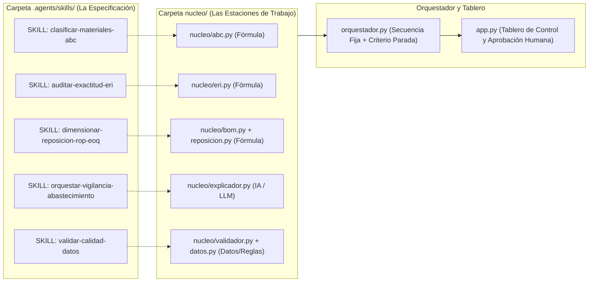

# 🎼 Especificación de Orquestación y Construcción de Módulos — E2 SAS
## De Piezas Sueltas a Sistema Integrado (Producción 4.0 / Énfasis II)

> **Institución:** Universidad de Medellín — Facultad de Ingenierías  
> **Programa:** Ingeniería Industrial — Producción 4.0  
> **Proyecto:** Sistema de Reposición y Abastecimiento E2 SAS  
> **Guía de Referencia:** `B3_03_Orquestacion_de_piezas_a_sistema (1).md`

---

## 📌 1. Diagnóstico: De la Skill (Procedimiento) al Módulo (Línea de Ensamble)

Una **skill** por sí sola no es un sistema; es la especificación en palabras de un procedimiento. Para que el sistema funcione de forma escalable, reproducible y auditable sin que un humano actúe como "pegamento manual", cada skill se materializó en un **módulo del núcleo** (`nucleo/`) con un **contrato estricto de entrada y salida**.



---

## 📋 2. Ficha de Contratos de los Módulos del Núcleo

Siguiendo la regla de oro: *"El contrato son dos líneas: qué RECIBE y qué ENTREGA en forma estructurada (nunca párrafos sueltos para cálculo)"*.

| Módulo | Tipo de Módulo | Responsabilidad Única | ¿Qué RECIBE? (Entrada) | ¿Qué HACE? | ¿Qué ENTREGA? (Salida Estructurada) |
|---|:---:|---|---|---|---|
| [`nucleo/datos.py`](file:///c:/Users/Laptop%20-%20Camila/OneDrive/Documentos/Proyecto%20E2/nucleo/datos.py) | **Datos** | Estado canónico y persistencia | Petición de lectura o dict de propuestas / decisiones. | Carga tablas canónicas saneadas de Supabase o registra decisiones de compra. | `dict` de DataFrames canónicos o confirmación de guardado. |
| [`nucleo/validador.py`](file:///c:/Users/Laptop%20-%20Camila/OneDrive/Documentos/Proyecto%20E2/nucleo/validador.py) | **Regla** | Calidad de datos (Capa 0) | `estado` (dict de DataFrames). | Audita 3FN, unicidad de SKU y ausencia de nulos críticos. | `{'valido': bool, 'hallazgos': list}` |
| [`nucleo/eri.py`](file:///c:/Users/Laptop%20-%20Camila/OneDrive/Documentos/Proyecto%20E2/nucleo/eri.py) | **Fórmula** | Auditoría Kardex y ERI (Queja 3) | `estado` (Kardex + Conteo Físico). | Calcula Saldo Teórico ($S_0 + Ent - Sal \pm Aj$), evalúa tolerancia $\pm 5\%$ y detecta fantasmas. | `{'eri_global_pct': float, 'fantasmas': list, 'df_auditoria': DataFrame}` |
| [`nucleo/bom.py`](file:///c:/Users/Laptop%20-%20Camila/OneDrive/Documentos/Proyecto%20E2/nucleo/bom.py) | **Fórmula** | Explosión de Demanda (Queja 4) | `plan_produccion` + `bom`. | Multiplica $Plan \times BOM$, anualiza ($12/21$) y calcula variabilidad diaria ($\sigma_d$). | `{'df_demanda_insumos': DataFrame, 'total_activos': int}` |
| [`nucleo/abc.py`](file:///c:/Users/Laptop%20-%20Camila/OneDrive/Documentos/Proyecto%20E2/nucleo/abc.py) | **Fórmula** | Demanda por Valor y Pareto | `df_demanda_insumos`. | Calcula $\text{Valor Anual} = D \times C_u$, ordena y asigna Clase A (80%), B (15%) y C (5%). | `{'df_abc': DataFrame, 'resumen_clases': dict}` |
| [`nucleo/reposicion.py`](file:///c:/Users/Laptop%20-%20Camila/OneDrive/Documentos/Proyecto%20E2/nucleo/reposicion.py) | **Fórmula** | Parámetros Dinámicos (Queja 4) | `df_abc` + `estado` (Lead Times). | Modela $SS = Z \cdot \sigma_d \sqrt{L}$, $ROP = d \cdot L + SS$ y $EOQ$. | `{'df_parametros': DataFrame}` |
| [`nucleo/explicador.py`](file:///c:/Users/Laptop%20-%20Camila/OneDrive/Documentos/Proyecto%20E2/nucleo/explicador.py) | **IA / LLM** | Redacción y Justificación | `df_quiebres` (Insumos con $Stock \le ROP$). | Redacta justificación ejecutiva en lenguaje natural blindada contra alucinaciones. | `list` de dicts estructurados con propuesta y justificación textual. |

---

## 🛑 3. Decisión de Arquitectura: Tipo de Orquestación y Criterio de Parada

### 3.1 Tipo de Orquestación Elegido: **Secuencia Fija con Criterio de Parada y Supervisión Humana (Mixta)**
* **Justificación de Ingeniería:** En la cadena de suministro de E2 SAS, el orden de las operaciones no es ambiguo: siempre se lee la base $\rightarrow$ se valida $\rightarrow$ se audita el Kardex $\rightarrow$ se explotan recetas BOM $\rightarrow$ se valoriza por Pareto $\rightarrow$ se calculan $ROP/EOQ$ $\rightarrow$ se detectan quiebres.
* **Proporción Fórmula vs. IA:**
  - **El número:** Calculado 100% por fórmulas determinísticas en Python.
  - **La explicación:** Redactada por el componente de lenguaje natural.

### 3.2 Criterio de Parada (Supervisión Humana Obligatoria)
El sistema **SE DETIENE OBLIGATORIAMENTE** cuando:
1. **Se generan propuestas de compra ($Stock \le ROP$):** Ninguna orden de compra compromete dinero automáticamente; el sistema pausa la ejecución y espera a que el planeador apruebe o rechace en el tablero.
2. **Inconsistencias críticas de datos:** Si se detectan claves foráneas rotas o duplicados en maestros, el orquestador aborta la corrida.
3. **Descuadres severos de ERI ($> \pm 5\%$):** Se genera alerta de auditoría previa a comprometer abastecimiento.

---

## 🖥️ 4. Tablero de Control Local (`app.py`)

La aplicación local corre directamente en el equipo mediante:
```bash
python app.py
```
- Abre automáticamente el navegador en `http://localhost:8501`.
- Cuenta con un botón central: **"Correr Reposición"**.
- Muestra el semáforo del **Criterio de Parada**, los KPIs ejecutivos (ERI, Quiebres, Inversión EOQ, Fantasmas) y la tabla interactiva de propuestas.
- Cada fila incluye la justificación generada y botones independientes de **"✓ Aprobar"** / **"✗ Rechazar"**, registrando la decisión con fecha y hora en `resultados_auditoria/registro_decisiones_compras.csv`.
