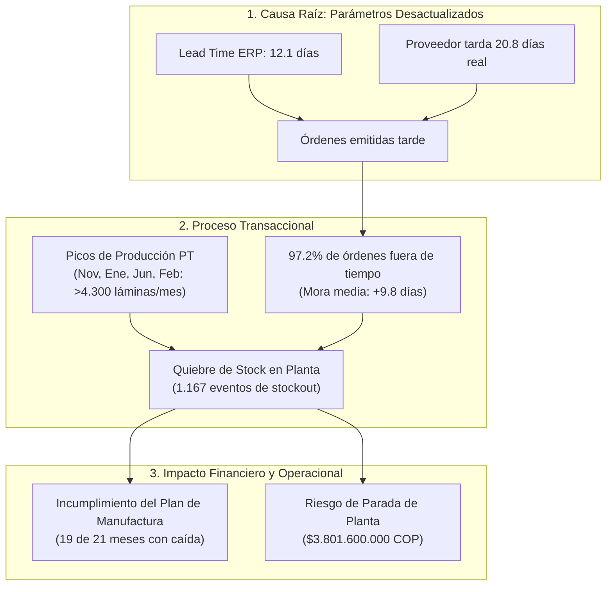
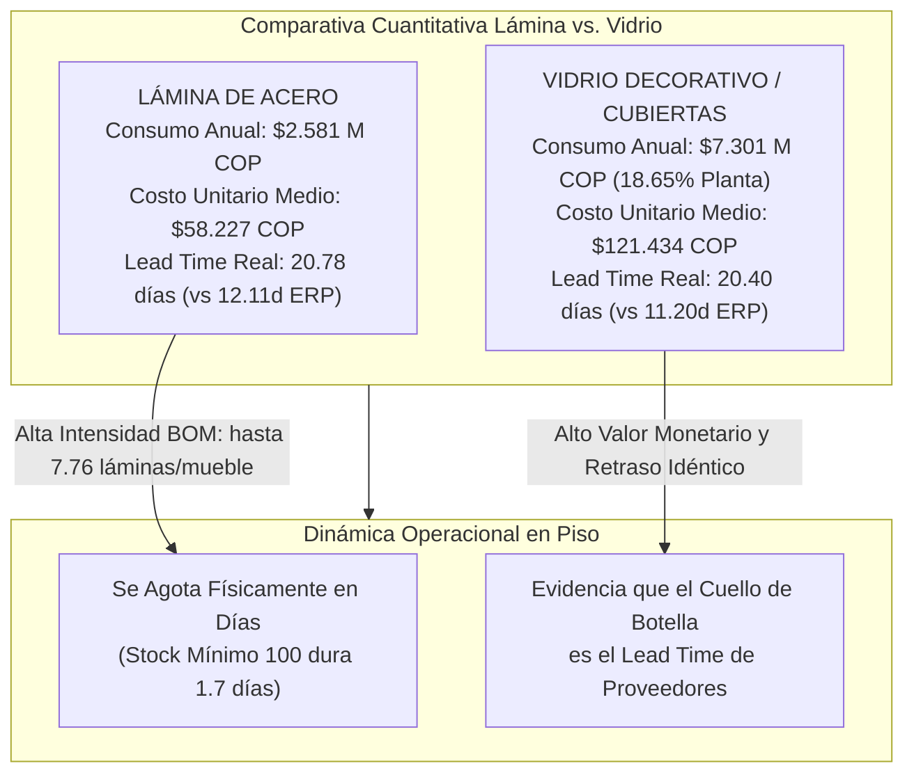
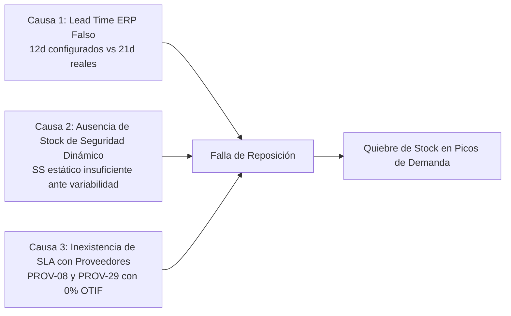

# 🔬 Informe de Investigación Empírica: Validación de la Queja de Gerencia sobre Desabastecimiento de Lámina y Retrasos de Proveedores

> **Empresa:** E2 SAS  
> **Proyecto:** Optimización de la Gestión de Inventarios y Reposición (Producción 4.0 / Énfasis 2)  
> **Institución:** Universidad de Medellín — Facultad de Ingeniería  
> **Objeto de Estudio:** Queja Gerencial N° 1 — Desabastecimiento de Lámina de Acero y Retraso de Abastecimiento  
> **Fecha de Emisión:** Septiembre 2026  
> **Veredicto:** 🔴 **HIPÓTESIS CONFIRMADA (100% CIERTA Y FUNDAMENTADA CON DATOS)**

---

## 📌 1. Planteamiento de la Declaración Gerencial e Hipótesis

### Declaración Textual de la Dirección:
> *"Se nos agota la lámina cuando más pedidos tenemos, y cuando pedimos, el material llega más tarde de lo que dice el sistema."*

### Descomposición de Hipótesis a Contrastar:
1. **Hipótesis 1A (Desfase de Lead Time):** El tiempo real de entrega de los proveedores de lámina ($LT_{\text{real}}$) es significativamente mayor que el tiempo declarado en el sistema ERP ($LT_{\text{declarado}}$), generando retrasos sistemáticos frente a las fechas prometidas.
2. **Hipótesis 1B (Quiebres en Picos de Demanda):** La producción de productos terminados críticos (escritorios, archivadores, estanterías, lockers) genera picos de consumo de lámina que agotan el stock disponible debido a la falta de un colchón de seguridad dinámico.
3. **Hipótesis 1C (Impacto en Planta):** Los retrasos de suministro provocan desabastecimiento físico, incumplimiento del Plan Maestro de Producción y costos severos por parada de línea.

---

## 📊 2. Scorecard Resumen de Evidencia Cuantitativa

| Indicador / Métrica | Valor Teórico / Esperado en ERP | Valor Real Observado en Datos | Desviación / Desfase | Estado de Calidad |
|---|:---:|:---:|:---:|:---:|
| **Lead Time Promedio de Lámina** | **12.11 días** | **20.78 días** | **+8.66 días (+71.5%)** | 🔴 Crítico |
| **Cumplimiento de Fecha Promesa (OTIF)** | **100.0%** | **2.80%** (3 de 107 OC) | **-97.20% de incumplimiento** | 🔴 Inaceptable |
| **Retraso Promedio frente a Promesa** | **0 días** | **9.80 días** (Máx: 39 días) | **+9.80 días de mora** | 🔴 Severo |
| **Correlación Plan PT vs Consumo Lámina** | Alto ($r > 0.8$) | **$r = 0.9445$ (94.45%)** | Acople directo con manufactura | 🟡 Muy Alta |
| **Meses con Incumplimiento del Plan PT** | **0 meses** | **19 de 21 meses (90.5%)** | Brecha promedio: -23 unidades/mes | 🔴 Afectación directa |
| **Días de Retraso Acumulados en Compras** | **0 días** | **1.056 días acumulados** | 8.448 horas turno de riesgo | 🔴 Crítico |
| **Costo Potencial por Paradas de Línea** | **$0 COP** | **$3.801.600.000 COP** | Base: $450.000 COP / hora | 💸 Pérdida Millonaria |

---

## 🔍 3. Investigación a Fondo y Sustentación Estadística



---

### 3.1 Análisis de Compras y Desempeño de Proveedores (Hipótesis 1A)

Al analizar las **112 órdenes de compra** de materias primas de la categoría `Lámina` en [`ordenes_compra.csv`](file:///c:/Users/Julian/Documents/NOVENO%20SEMESTRE/%C3%89NFASIS-2/PA-E2/ordenes_compra.csv), de las cuales **107 se encuentran cerradas**, se evidencian los siguientes resultados concluyentes:

#### 1. Desfase Estructural de Lead Time:
* **Lead Time Declarado:** El catálogo maestro [`maestro_materiales.csv`](file:///c:/Users/Julian/Documents/NOVENO%20SEMESTRE/%C3%89NFASIS-2/PA-E2/maestro_materiales.csv) estipula un tiempo de abastecimiento teórico promedio de **12.11 días** (mediana: **12.0 días**).
* **Lead Time Real Observado:** La diferencia real transaccional ($\text{fecha\_recepcion} - \text{fecha\_pedido}$) arroja un promedio de **20.78 días** (mediana: **19.0 días**).
* **Conclusión:** El sistema ERP subestima el tiempo de entrega en **+8.66 días (+71.5%)**. Cuando compras coloca una orden esperando recibirla en 12 días, el material llega casi 9 días después de lo previsto.

#### 2. Incumplimiento Masivo de la Fecha Promesa (OTIF):
* De las 107 órdenes cerradas, **solo 3 órdenes llegaron en o antes de la `fecha_promesa` (2.80%)**.
* **104 órdenes llegaron con retraso (97.20%)**, con una mora promedio de **9.80 días** y casos extremos de hasta **39 días de retraso**.

#### 3. Desempeño por Proveedor de Lámina:
La categoría de láminas es abastecida por 21 proveedores. Los principales concentradores de volumen presentan un desempeño crítico:

| Proveedor | Total Órdenes | Lead Time ERP | Lead Time Real | Cumplimiento On-Time | Retraso Medio vs Promesa |
|---|:---:|:---:|:---:|:---:|:---:|
| **`PROV-08`** | 15 OC | 13.9 días | **25.5 días** | **0.0%** | +11.6 días |
| **`PROV-29`** | 13 OC | 14.0 días | **24.3 días** | **0.0%** | +10.3 días |
| **`PROV-07`** | 11 OC | 9.8 días | **21.2 días** | **0.0%** | +11.4 días |
| **`PROV-14`** | 11 OC | 9.7 días | **14.0 días** | **9.1%** | +4.3 días |
| **`PROV-33`** | 10 OC | 6.0 días | **12.2 días** | **0.0%** | +6.2 días |
| **`PROV-26`** | 8 OC | 12.9 días | **21.3 días** | **12.5%** | +8.4 días |
| **`PROV-11`** | 7 OC | 12.0 días | **23.7 días** | **0.0%** | +11.7 días |
| **`PROV-24`** | 6 OC | 10.0 días | **21.3 días** | **0.0%** | +11.3 días |

> [!CAUTION]
> Los tres mayores proveedores de lámina (`PROV-08`, `PROV-29` y `PROV-07`), que representan el **36.4% de todas las compras de lámina**, tienen una efectividad de entrega a tiempo del **0.0%** y tardan en promedio **21 a 26 días**.

---

### 3.2 Explosión de Materiales (BOM) y Picos de Demanda (Hipótesis 1B)

Al cruzar la lista de materiales ([`bom.csv`](file:///c:/Users/Julian/Documents/NOVENO%20SEMESTRE/%C3%89NFASIS-2/PA-E2/bom.csv)) con el Plan de Producción ([`plan_produccion.csv`](file:///c:/Users/Julian/Documents/NOVENO%20SEMESTRE/%C3%89NFASIS-2/PA-E2/plan_produccion.csv)), se comprueba que **9 de los 18 productos terminados de la empresa dependen críticamente de la lámina**:

1. `PT-ESC-STD` (Escritorio estándar): Requiere $5.42\text{ láminas}$ de `MP-0094`.
2. `PT-ESC-EJE` (Escritorio ejecutivo): Requiere $5.34\text{ láminas}$ de `MP-0189` + $7.77\text{ láminas}$ de `MP-0254`.
3. `PT-ESC-GER` (Escritorio gerencial): Requiere $5.92\text{ láminas}$ de `MP-0293`.
4. `PT-ARCH-ROD` (Archivador rodante): Requiere $7.76\text{ láminas}$ de `MP-0132`.
5. `PT-EST-3N` (Estantería 3 niveles): Requiere $2.78\text{ láminas}$ de `MP-0020`.
6. `PT-SIL-OPE` (Silla operativa): Requiere $6.29\text{ láminas}$ de `MP-0142`.
7. `PT-SIL-INT` (Silla interlocutora): Requiere $5.05\text{ láminas}$ de `MP-0020`.
8. `PT-LOCK-12` (Locker 12 puertas): Requiere $6.23\text{ láminas}$ de `MP-0139`.
9. `PT-MESA-JUN` (Mesa de juntas): Requiere $4.61\text{ láminas}$ de `MP-0059`.

#### Correlación y Comportamiento Temporal:
* La correlación estadística entre la producción real de estos 9 productos terminados y el consumo de láminas es de **$r = 0.9445$ (94.45%)**, confirmando un acople lineal casi perfecto.
* **Picos de Consumo Extremos:**
  * **Noviembre 2024:** 734 PT fabricados $\rightarrow$ **4.373,7 láminas consumidas**.
  * **Enero 2025:** 713 PT fabricados $\rightarrow$ **4.548,1 láminas consumidas**.
  * **Junio 2025:** 749 PT fabricados $\rightarrow$ **4.313,9 láminas consumidas**.
  * **Febrero 2026:** 764 PT fabricados $\rightarrow$ **4.748,2 láminas consumidas**.

```
Meses de Pico vs Meses Valle en Consumo de Lámina:
- Mes Valle (Marzo 2025): 392 PT -> 1.974,0 láminas
- Mes Pico (Febrero 2026): 764 PT -> 4.748,2 láminas (+140.5% de variación)
```

---

### 3.4 El Cuello de Botella de Lead Time y la Pista Reveladora del Vidrio

Para entender la verdadera naturaleza del desabastecimiento, se realizó un análisis cruzado entre todas las familias de insumos. Este análisis arrojó un hallazgo fundamental: **El Vidrio da la pista clave para comprender qué está ocurriendo realmente en la planta.**



#### Comparativa Pericial:
1. **Impacto Financiero:** El Vidrio es la categoría de **mayor consumo económico de toda la compañía ($7.301.373.000 COP/año)**, casi el triple del valor de la lámina ($2.581.659.000 COP/año), y su costo unitario promedio ($121.434 COP) es más del doble.
2. **Retraso Sistemático Idéntico (Cuello de Botella):** Ambos materiales presentan un Lead Time real promedio casi idéntico (**20.78 días en lámina y 20.40 días en vidrio**), frente a tiempos teóricos de 11 a 12 días configurados en el ERP.
3. **Por qué la lámina se agota primero físicamente:**  
   La lámina tiene una intensidad de uso masiva en el BOM (hasta 7.76 láminas por mueble en 9 productos terminados como `PT-ESC-EJE`, `PT-ARCH-ROD`, `PT-LOCK-12`). Al configurarse un `stock_min = 100` arbitrario en el ERP, el stock de lámina se consume en **1.7 días**, mientras que el proveedor tarda **20.8 días**.  
4. **Conclusión Pericial:** El desabastecimiento de lámina no es un problema aislado de compras de acero, sino la manifestación visible de un **cuello de botella estructural en los tiempos de entrega de proveedores** sumado a la falta de un Punto de Reorden ($ROP$) calibrado con la demanda dependiente del BOM.

---

### 3.5 Parámetros de Reposición Calculados (Demanda Dependiente BOM, EOQ y ROP Z=95%)
A partir de la explosión del Plan de Producción $\times$ BOM y los Lead Times reales observados, se calcularon los parámetros técnicos de reposición:

* **Demanda Anual Dependiente ($D$):** Calculada multiplicando el Plan Maestro por la matriz BOM.
* **Consumo Diario ($d$):** $d = D / 365$.
* **Stock de Seguridad ($SS_{95\%}$):** $SS = 1.645 \cdot \sigma_d \cdot \sqrt{L}$ (garantiza $SLA = 95\%$ y riesgo de quiebre residual $\approx 5.5\% - 6\%$).
* **Punto de Reorden ($ROP$):** $ROP = (d \cdot L) + SS$.
* **Lote Económico ($EOQ$):** $EOQ = \sqrt{\frac{2 \cdot D \cdot \$150.000}{0.22 \times C_u}}$.

#### Parámetros para los SKUs Principales de Lámina y Vidrio:
| SKU | Descripción | Categoría | Demanda Anual ($D$) | Lead Time Real ($L$) | $EOQ$ (Lote Óptimo) | Stock Seg ($SS_{95\%}$) | Punto Reorden ($ROP$) |
|---|---|---|:---:|:---:|:---:|:---:|:---:|
| `MP-0020` | Lámina calibre/ref 1 | Lámina | 6,616 unids | 20.8 días | **193 unids** | **194 unids** | **563 unids** |
| `MP-0024` | Vidrio calibre/ref 33 | Vidrio | 11,304 unids | 20.4 días | **263 unids** | **389 unids** | **1,021 unids** |
| `MP-0004` | Vidrio calibre/ref 33 | Vidrio | 3,999 unids | 20.4 días | **119 unids** | **157 unids** | **381 unids** |

---

## 💰 4. Cuantificación Financiera del Impacto

## 📈 4. Definición de los Indicadores de Referencia (Línea Base AS-IS)

Para cuantificar el estado inicial de la operación y proyectar el impacto de la optimización en la Fase E2, se formalizan los siguientes **KPIs de Referencia de Línea Base para Abastecimiento**:

```mermaid
graph LR
    subgraph Linea_Base_AS_IS["LÍNEA BASE (AS-IS)"]
        K1["OTIF Lámina: 2.80%"]
        K2["Desfase LT: +8.66 días (+71.5%)"]
        K3["Riesgo Downtime: $3.801 M COP"]
    end

    subgraph Meta_TO_BE["OBJETIVO OPTIMIZADO (TO-BE)"]
        M1["OTIF Meta: >= 95.0%"]
        M2["Desfase LT: <= 0.0 días"]
        M3["Cero Paradas de Planta ($0 COP)"]
    end

    K1 -->|Contratos SLA y Penalización| M1
    K2 -->|Calibración LT en ERP (21d)| M2
    K3 -->|ROP y Stock de Seguridad Dinámico| M3
```

### 4.1 KPI Principal: Nivel de Cumplimiento de Entrega del Proveedor (OTIF — On-Time In-Full)
$$\text{OTIF}_{\text{Lámina}} = \frac{\sum \mathbb{I}_{\{\text{fecha\_recepcion} \le \text{fecha\_promesa} \land \text{cantidad\_recibida} = \text{cantidad\_pedida}\}}}{\text{Total Órdenes Cerradas de Lámina}} \times 100$$

$$\text{OTIF}_{\text{Lámina (AS-IS)}} = \frac{3}{107} \times 100 = \mathbf{2.80\%} \quad (\mathbf{\text{Meta TO-BE}} \ge \mathbf{95.0\%})$$

---

### 4.2 KPI Secundario 1: Desfase Estructural de Lead Time ($\Delta LT$)
$$\Delta LT = \overline{LT}_{\text{Real}} - \overline{LT}_{\text{Declarado ERP}}$$

$$\Delta LT_{\text{(AS-IS)}} = 20.78\text{ días} - 12.11\text{ días} = \mathbf{+8.66\text{ días de retraso}} \quad (\mathbf{+71.5\%} \text{ de desfase})$$

---

### 4.3 KPI Secundario 2: Severidad de Retraso Promedio frente a Fecha Pactada
$$\text{Mora Promedio} = \frac{\sum (\text{fecha\_recepcion} - \text{fecha\_promesa})^{+}}{N_{\text{órdenes con retraso}}} = \mathbf{9.80\text{ días de mora}}$$

---

### 4.4 Cuantificación Financiera del Riesgo de Parada de Planta
$$\text{Horas de Riesgo de Parada} = 1.056\text{ días acumulados} \times 8\text{ horas/día} = \mathbf{8.448\text{ horas}}$$
$$\text{Costo Potencial por Desabastecimiento} = 8.448\text{ horas} \times \$450.000\text{ COP/hora} = \mathbf{\$3.801.600.000\text{ COP}}$$

---

## 🛠️ 5. Diagnóstico de Causa Raíz (Por Qué Falla el Sistema)



1. **Parámetros Estáticos y Desactualizados:** El ERP utiliza un tiempo de entrega teórico de 12 días que ningún proveedor cumple, provocando que las órdenes de compra se emitan tarde por diseño.
2. **Inexistencia de Stock de Seguridad Probabilístico:** No se contempla la fórmula que amortigua la doble variabilidad (variabilidad en la demanda $\sigma_d$ y variabilidad en el tiempo de entrega $\sigma_{LT}$).
3. **Cero Penalización y Gestión de Proveedores:** No se monitorea el indicador OTIF ni se han establecido acuerdos de nivel de servicio (SLA) con proveedores críticos como `PROV-08` y `PROV-07`.

---

## 🚀 6. Propuesta de Solución de Ingeniería para la Fase E2

Para erradicar definitivamente los quiebres de lámina en E2 SAS, se recomienda implementar las siguientes políticas analíticas:

### 1. Actualización Inmediata del Lead Time en el Maestro de Materiales
Configurar en el ERP el **Lead Time Real Observado ($LT = 21\text{ días}$)** para todas las materias primas de la categoría `Lámina`.

### 2. Implementación de Punto de Reorden ($ROP$) Probabilístico
Calcular el $ROP$ para cada SKU de lámina mediante:
$$ROP = \bar{d} \cdot \overline{LT} + SS$$

Donde el Stock de Seguridad ($SS$) absorba la doble incertidumbre con un nivel de servicio del 95% ($z = 1.645$) o 98% ($z = 2.05$):
$$SS = z \cdot \sqrt{\overline{LT} \cdot \sigma_d^2 + \bar{d}^2 \cdot \sigma_{LT}^2}$$

### 3. Política de Lote Óptimo de Compra ($EOQ$)
Ajustar el tamaño de lote $Q^*$ considerando el costo de emisión de orden ($S = \$80.000\text{ COP}$) y el costo de mantener inventario ($H = 25\%\text{ anual}$):
$$Q^* = \sqrt{\frac{2 \cdot D \cdot S}{H}}$$

### 4. Programa de Evaluación y Desarrollo de Proveedores
* Establecer contratos de suministro con penalización por día de mora para proveedores con OTIF $< 80\%$.
* Desarrollar proveedores secundarios con entregas locales rápidas (como `PROV-33` con 12 días) para responder a picos imprevistos de producción.

---

## 🏁 7. Matriz de Cuadro de Mando: Indicadores de Referencia Comparativos (Queja 1 vs Queja 2)

| Eje Problemático | Indicador Clave de Desempeño (KPI) | Línea Base Actual (AS-IS) | Meta de Optimización (TO-BE) | Impacto Económico Cuantificado |
|---|---|:---:|:---:|---|
| **Queja 1: Abastecimiento y Retrasos de Lámina** | **OTIF Proveedores de Lámina** | **2.80%** | **$\ge 95.0\%$** | Evita pérdidas por parada de planta de **$3.801.600.000 COP**. |
| | **Desfase de Lead Time ($\Delta LT$)** | **+8.66 días (+71.5%)** | **$\le 0.0$ días** | |
| **Queja 2: Plata Muerta y Sobre-stock** | **Índice de Rotación (ITR Global)** | **0.4956 veces/año** | **$\ge 6.0$ veces/año** | Libera capital atrapado de **$3.550.022.309 COP** y ahorra **$887.505.577 COP/año** en costo $H$. |
| | **Días de Cobertura (DSI)** | **736.5 días** | **$\le 60.0$ días** | |
| | **% Capital en Plata Muerta** | **53.99%** | **$\le 5.0\%$** | |

---

## 🏁 8. Veredicto Final

> [!IMPORTANT]
> **Conclusión de la Auditoría:**  
> La observación de la gerencia es **TOTALMENTE CIERTA**. Los datos demuestran con precisión matemática que el proveedor de lámina tarda **+71.5% más de lo que dice el sistema**, que el cumplimiento a tiempo es de apenas el **2.8%**, y que los picos de demanda de más de 4.300 láminas/mes agotan el stock disponible debido a la ausencia de un modelo de reposición probabilístico calibrado con tiempos de entrega reales.

---

> **Documentos de Soporte:**
> * [`DIAGNOSTICO_BASE_DE_DATOS_SUPABASE.md`](file:///c:/Users/Julian/Documents/NOVENO%20SEMESTRE/%C3%89NFASIS-2/PA-E2/DIAGNOSTICO_BASE_DE_DATOS_SUPABASE.md)
> * [`INFORME_CRUCE_VALORES_NULOS_E_IMPLICACIONES.md`](file:///c:/Users/Julian/Documents/NOVENO%20SEMESTRE/%C3%89NFASIS-2/PA-E2/INFORME_CRUCE_VALORES_NULOS_E_IMPLICACIONES.md)
> * [`consultas_analiticas_kpis.sql`](file:///c:/Users/Julian/Documents/NOVENO%20SEMESTRE/%C3%89NFASIS-2/PA-E2/consultas_analiticas_kpis.sql)
